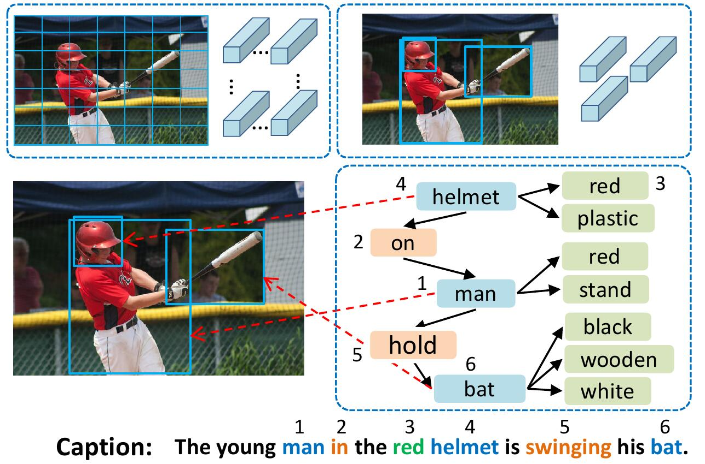

# [Aligning Linguistic Words and Visual Semantic Units for Image Captioning](https://arxiv.org/pdf/1908.02127.pdf)

## Introduction
VSUA model represents images as structured graphs where nodes are the so-called Visual Semantic Units (VSUs): object, attribute, and relationship units. Our VSUA model makes use of the alignment nature between caption words and VSUs.

<p align="center">
  
</p>

## Citation

If you find this code useful in your research then please cite
```
@inproceedings{guo2019vsua,
 title={Aligning Linguistic Words and Visual Semantic Units for Image Captioning},
 author={Longteng Guo, Jing Liu, Jinhui Tang, Jiangwei Li, Wei Luo, and Hanqing Lu},
 booktitle={ACM MM},
 year={2019}}
```
## Requirements
- Cuda-enabled GPU
- Python 2.7, and PyTorch >= 0.4
- [Cider](https://github.com/vrama91/cider) (already been added as a submodule)
- Optionally:
	- [coco-caption](https://github.com/tylin/coco-caption) (already been added as a submodule): If you'd like to evaluate BLEU/METEOR/CIDEr scores
	- [tensorboardX](https://github.com/lanpa/tensorboardX): If you want to visualize the loss histories (needs to install TensorFlow).
	
To install all submodules: `git clone --recursive https://github.com/ltguo19/VSUA-Captioning.git`

## Prepare Data
For more details and other dataset, see [ruotianluo/self-critical.pytorch](https://github.com/ruotianluo/self-critical.pytorch/blob/master/data/README.md)

### 1. Download COCO captions and preprocess them

Download preprocessed coco captions from [link](http://cs.stanford.edu/people/karpathy/deepimagesent/caption_datasets.zip) from Karpathy's homepage. Extract `dataset_coco.json` from the zip file and copy it into `data/`. This file provides preprocessed captions and also standard train-val-test splits.

Then do:

```bash
$ python scripts/prepro_labels.py --input_json data/dataset_coco.json --output_json data/cocotalk.json --output_h5 data/cocotalk
```

`prepro_labels.py` will map all words that occur <= 5 times to a special `UNK` token, and create a vocabulary for all the remaining words. The image information and vocabulary are dumped into `data/cocotalk.json` and discretized caption data are dumped into `data/cocotalk_label.h5`.

### 2. Download Bottom-Up features
We use the pre-extracted [bottom-up](https://github.com/peteanderson80/bottom-up-attention) image features. Download pre-extracted feature from [link](https://github.com/peteanderson80/bottom-up-attention#pretrained-features) (we use the adaptive one in our experiments).
For example:
```bash
mkdir data/bu_data; cd data/bu_data
wget https://storage.googleapis.com/bottom-up-attention/trainval.zip
unzip trainval.zip
```
Then:
```bash
python script/make_bu_data.py --output_dir data/cocobu
```
This will create `data/cocobu_fc`, `data/cocobu_att` and `data/cocobu_box`.

### 3. Download image scene graph data
We use the scene graph data from [yangxuntu/SGAE](https://github.com/yangxuntu/SGAE). Download the files `coco_img_sg.zip` and `coco_pred_sg_rela.npy` from this [link](https://drive.google.com/drive/folders/1GvwpchUnfqUjvlpWTYbmEvhvkJTIWWRb?usp=sharing) and put them into the folder `data` and then unzip them.
`coco_img_sg.zip` contains scene graph data for each image, including object labels and attributes labels for each box in the adaptive bottom-up data, and the semantic relationship labels between boxes. `coco_pred_sg_rela.npy` contains the vocabularies for the object, attribute and relation labels.

### 4. Extract geometry relationship data
Download the files `vsua_box_info.pkl` from this [link](https://drive.google.com/open?id=1G9_ZdjyIprl2wyWCExslWTWOimJf3x8G), which contains the size of each box and the width/height of each image.
Then do:
```bash
python scripts/cal_geometry_feats.py
python scripts/build_geometry_graph.py
```
to extract the geometry relation features and build the geometry graph. This will create`data/geometry_feats-undirected.pkl` and `data/geometry-iou0.2-dist0.5-undirected`.

Overall, the data folder should contain these files/folders:
```bash
cocotalk.json         	# additional information about images and vocab
cocotalk_label.h5       # captions
coco-train-idxs.p       # cached token file for cider
cocobu_att              # bottom-up feature
cocobu_fc               # bottom-up average feature
coco_img_sg             # scene graph data
coco_pred_sg_rela.npy   # scene graph vocabularies
vsua_box_info.pkl       # boxes and width and height of images
geometry-iou0.2-dist0.5-undirected  # geometry graph data
```
## Training
### 1. Cross-entropy loss
```bash
python train.py --gpus 0 --id experiment-xe --geometry_relation True
```
The train script will dump checkpoints into the folder specified by `--checkpoint_root` and `--id`.
### 2. Reinforcement learning with CIDEr reward
```bash
python train.py --gpus 0 --id experiment-rl --geometry_relation True --learning_rate 5e-5 --resume_from experiment-xe --resume_from_best True --self_critical_after 0 --max_epochs 50
```

- `--gpu` specifies the GPU used to run the model. `--id` is the name of this experiment and all information and checkpoints will be dumped to `checkpoint_root/id` folder.
- `--geometry_relation` specifies the type of relationship to use. True: use geometry relationship, False: use semantic relationship.
- To resume training, you can specify `--resume_from` option to be the experiment id you want to resume from, and use `--resume_from_best` to choose whether to resume from the best-performing checkpoint or the latest checkpoint.
- If you have TensorFlow, the loss histories are automatically dumped into `checkpoint_root/id`, and can be visualized using tensorboard by `sh script/tensorboard.sh`.
- If you'd like to evaluate BLEU/METEOR/CIDEr scores during training in addition to validation cross-entropy loss, use `--language_eval 1` option, but don't forget to download the [coco-caption code](https://github.com/tylin/coco-caption) into `coco-caption` directory.
- For more options, see `opts.py`. And see [self-critical.pytorch](https://github.com/ruotianluo/self-critical.pytorch) for more training guidance.

## Acknowledgement
This code is modified from Ruotian Luo's brilliant image captioning repo [ruotianluo/self-critical.pytorch](https://github.com/ruotianluo/self-critical.pytorch).  We use the visual features provided by Bottom-Up   [peteanderson80/bottom-up-attention](https://github.com/peteanderson80/bottom-up-attention), and the scene graph data provided by [yangxuntu/SGAE](https://github.com/yangxuntu/SGAE). Thanks for their works!
If you find this code helpful, please consider citing their corresponding papers and our paper.
